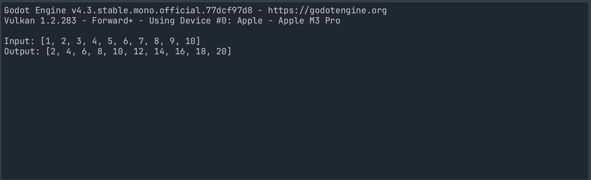

# Shader 1 (your first 3D shader)

# Shader 2 (your second 3D shader)

# Shader 3 (using compute shaders)
## Overview
This example demonstrates how to use a compute shader in Godot to perform general-purpose GPU computations. Instead of rendering geometry, the shader processes an array of floats by multiplying each value by 2, then returns the updated results. We use a dedicated .glsl file for the compute shader and a GDScript script to load, dispatch, and retrieve the results.
```
#[compute]
#version 450

layout(local_size_x = 2, local_size_y = 1, local_size_z = 1) in;

layout(set = 0, binding = 0, std430) restrict buffer MyDataBuffer {
    float data[];
} my_data_buffer;

void main() {
    my_data_buffer.data[gl_GlobalInvocationID.x] *= 2.0;
}
```
## How to Run
1. Open Project: Launch Godot 4.x and import this folder as a project (make sure Forward+ or Mobile renderer is selected).
2. Open Scene: In the shader3 folder, open the scene file (e.g., shader3.tscn).
3. Play: Press Play (or F5).
4. Check Output: View the console to see the input array and the doubled output from the compute shader.
## What Happens
1. A local rendering device is created for compute operations.
2. The shader takes a buffer containing 10 float values.
3. The compute shader runs on the GPU, processing each element in parallel.
4. The updated array is read back to confirm the multiplication was successful.
## Results

This confirms that the compute shader correctly doubled each element.

# Shader 4 (custom)

# Shader 5 (custom)
