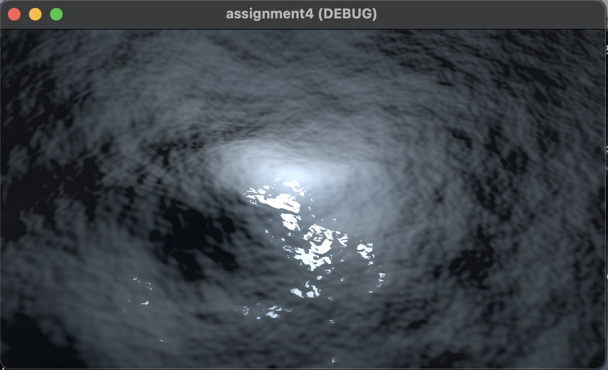

# Shader 1 (your first 3D shader)
## Overview
This example demonstrates how to create a terrain-like mesh by displacing the vertices of a plane using a heightmap. A noise texture is sampled in the vertex function to raise or lower each vertex, and a matching normal map is applied in the fragment function to correctly respond to lighting.
```
shader_type spatial;
uniform sampler2D noise;
uniform sampler2D normalmap;
uniform float height_scale = 0.5;
varying vec2 tex_position;

void vertex() {
	// Called for every vertex the material is visible on.
	tex_position = VERTEX.xz / 2.0 + 0.5;
	float height = texture(noise, tex_position).x;
	VERTEX.y += height * height_scale;
}

void fragment() {
	// Called for every pixel the material is visible on.
	NORMAL_MAP = texture(normalmap, tex_position).xyz;
}
```
## How to Run
1. Open Project: Launch Godot 4.x and import this folder as a project.
2. Open Scene: In the shader1 folder, open the scene file (e.g., shader1.tscn).
3. Play: Press Play (or F5).
4. View Terrain: You should see a plane mesh with raised “hills” based on the noise texture.
## What Happens
A PlaneMesh is subdivided (e.g., 32×32) to allow enough vertices for displacement.
In the vertex() function, the noise texture is sampled to obtain a height value, which is added to each vertex’s y position.
A normalmap is sampled in the fragment() function to ensure lighting accurately reflects the displaced geometry.
The height_scale uniform can be tweaked to adjust the overall amplitude of the terrain.
## Results
Below are two screenshots showcasing the displaced plane in the Godot editor and during runtime:


You can see how the mesh is no longer flat—noise-based displacement creates the illusion of hills or uneven terrain. This forms the basis for more advanced techniques such as dynamic landscapes or water surfaces.
# Shader 2 (your second 3D shader)
## Overview
This example builds on the first 3D shader by transforming a simple plane into a stylized ocean. It demonstrates:
- **Vertex displacement** using multiple wave layers.
- **Custom PBR settings** (e.g., `ROUGHNESS`, `METALLIC`) for a water-like appearance.
- **Fresnel reflections** to enhance realism at shallow viewing angles.
- **Animated waves** driven by the built-in `TIME` variable.
```
shader_type spatial;
uniform sampler2D noise;
uniform float height_scale = 0.1;
uniform sampler2D normalmap;
varying vec2 tex_position;
render_mode specular_toon;

float wave(vec2 position){
	position += texture(noise, position / 10.0).x * 2.0 - 1.0;
	vec2 wv = 1.0 - abs(sin(position));
	return pow(1.0 - pow(wv.x * wv.y, 0.65), 4.0);
}

float height(vec2 position, float time) {
	float d = wave((position + time) * 0.4) * 0.3;
	d += wave((position - time) * 0.3) * 0.3;
	d += wave((position + time) * 0.5) * 0.2;
	d += wave((position - time) * 0.6) * 0.2;
	return d;
}

void vertex() {
	// Called for every vertex the material is visible on.
	tex_position = VERTEX.xz / 2.0 + 0.5;
	// VERTEX.y += height * height_scale;
	vec2 pos = VERTEX.xz;
	float k = height(pos, TIME);
	VERTEX.y = k;
	NORMAL = normalize(vec3(k - height(pos + vec2(0.1, 0.0), TIME), 0.1,
		k - height(pos + vec2(0.0, 0.1), TIME)));
}

void fragment() {
	// Called for every pixel the material is visible on.
	float fresnel = sqrt(1.0 - dot(NORMAL, VIEW));
	RIM = 0.2;
	METALLIC = 0.0;
	ROUGHNESS = 0.01 * (1.0 - fresnel);
	ALBEDO = vec3(0.01, 0.03, 0.05) + (0.1 * fresnel);
	NORMAL_MAP = texture(normalmap, tex_position).xyz;
}
```
## How to Run
1. Open Project: Launch Godot 4.x and import this folder as a project (Forward+ or Mobile renderer).  
2. Open Scene: In the `shader2` folder, open the scene file (e.g., `shader2.tscn`) containing the `MeshInstance3D` that uses `shader2.gdshader`.  
3. Play: Press **Play** (or F5).  
4. Observe Waves: You should see animated waves on the plane, with highlights and rim lighting to mimic stylized water.
## What Happens
1. Waves via Vertex Function
   - The mesh’s **y** position is displaced according to a layered noise-based wave function.  
   - `TIME` is used to animate the waves, moving them in opposite directions for a more natural effect.  
2. Fresnel and Rim Lighting
   - The `fragment()` function calculates a Fresnel term (`dot(NORMAL, VIEW)`) to blend between color and reflectivity.  
   - `RIM` is set to enhance the highlights around the edges.  
3. PBR Parameters
   - `METALLIC` is set to 0.0 (non-metal) while `ROUGHNESS` is very low, creating reflective, shiny water.  
   - A **normal map** is sampled (`NORMAL_MAP`) to add fine detail to the water surface.  
4. Specular Toon**  
   - `render_mode specular_toon;` gives more pronounced specular highlights, adding to the stylized aesthetic.
## Results
Below are two screenshots illustrating the stylized ocean effect in the editor and at runtime:


You can see the layered waves, the Fresnel-based edge highlights, and the reflective surface that changes with the camera angle. The final effect is a dynamic, stylized body of water that demonstrates more advanced shader techniques in Godot.
# Shader 3 (using compute shaders)
## Overview
This example demonstrates how to use a compute shader in Godot to perform general-purpose GPU computations. Instead of rendering geometry, the shader processes an array of floats by multiplying each value by 2, then returns the updated results. We use a dedicated .glsl file for the compute shader and a GDScript script to load, dispatch, and retrieve the results.
```
#[compute]
#version 450

layout(local_size_x = 2, local_size_y = 1, local_size_z = 1) in;

layout(set = 0, binding = 0, std430) restrict buffer MyDataBuffer {
    float data[];
} my_data_buffer;

void main() {
    my_data_buffer.data[gl_GlobalInvocationID.x] *= 2.0;
}
```
## How to Run
1. Open Project: Launch Godot 4.x and import this folder as a project (make sure Forward+ or Mobile renderer is selected).
2. Open Scene: In the shader3 folder, open the scene file (e.g., shader3.tscn).
3. Play: Press Play (or F5).
4. Check Output: View the console to see the input array and the doubled output from the compute shader.
## What Happens
1. A local rendering device is created for compute operations.
2. The shader takes a buffer containing 10 float values.
3. The compute shader runs on the GPU, processing each element in parallel.
4. The updated array is read back to confirm the multiplication was successful.
## Results

This confirms that the compute shader correctly doubled each element.
# Custom Shaders (custom vertex shader, custom fragment shader, screen-reading shader)
## Overview
This example demonstrates **wave deformation** in the vertex stage, combined with **water reflection/refraction** in the fragment stage. The vertex shader displaces the plane using a noise-augmented sine wave, creating an animated ocean surface. The fragment shader applies a Fresnel highlight and samples the screen texture (screen-reading) to simulate reflections. A GDScript script lets users dynamically adjust parameters in real time.
  
## How to Run
1. **Open Project**: Launch Godot 4.x and import this project folder.
2. **Open Scene**: In the `custom_shaders` folder, open the scene file (e.g., `water_animation.tscn`) containing the `MeshInstance3D` that uses the custom ShaderMaterial.
3. **Play**: Press **Play** (or F5).
4. **Use Arrow Keys**:  
   - **Up/Down** arrows change the **wave height**.  
   - **Left/Right** arrows modify the **water_color_strength** (reflection intensity).  
   - Observe real-time changes in the water’s appearance.
## What Happens
1. **Vertex Displacement**  
   - The plane’s vertices move according to a sine wave combined with a noise texture, creating rolling waves.  
   - A finite-difference approach approximates the dynamic normals, ensuring accurate lighting on the displaced surface.
2. **Screen-Reading Fragment**  
   - The fragment shader reads from the **screen texture** (`hint_screen_texture`) to produce reflection and refraction effects.  
   - A Fresnel factor adds realistic highlights at shallow angles, and a directional light provides basic shading.
3. **Arrow Key Interactivity**  
   - Pressing **Up** or **Down** increases/decreases the wave height in real time.  
   - Pressing **Right** or **Left** intensifies or reduces the reflection color strength, making the water more or less mirror-like.
4. **Extra Credit: Screen-Reading**  
   - Because the fragment shader samples the screen texture, this setup implements a screen-reading shader.  
   - This allows dynamic reflections of background objects, fulfilling the extra credit requirement.
## Results
- **Real-Time Changes**: Users can immediately see the waves get taller or shorter, and reflections become stronger or weaker, demonstrating interactive parameter updates via GDScript.  
- **Performance**: Testing with Godot’s Debugger/Monitors shows stable 145 FPS, indicating minimal performance impact.  
- **Screenshots**: Below are images showing the water surface at different parameter settings (wave height and reflection intensity).  
  


**HERE IS A DEMO LINK**: [link](https://youtu.be/80d95Q0Pxz4)